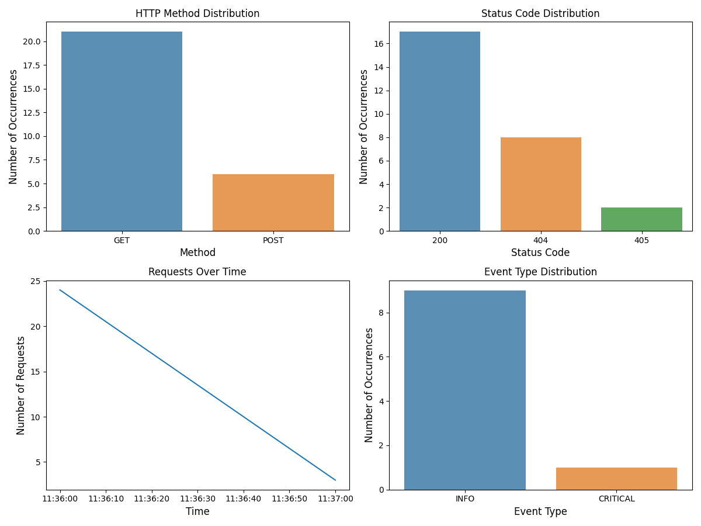

# Description

GServerManager is an interactive command-line interface (CLI) tool for managing multiple `gunicorn` servers. It allows users to add, remove, start, stop, restart, monitor, update servers, manage server logs, and handle servers' GitHub settings. The tool is built using `Rust`, and is designed to be intuitive and easy to use. It also provides event-triggered backups and visualization tools, making it much easier to manage multiple servers on the same machine.

# Getting Started

## Prerequisites
* Rust Programming Language: You can download Rust from the [official website](https://www.rust-lang.org/tools/install).
* If you would like to use the data tools provided, then `python >= 3.9` is required.
* This application supports `redis`, if you would need to use it in your server, checkout their [official website](https://redis.io/docs/getting-started/)

## Installation
1. Clone the repo: `git clone https://github.com/SnowCheetos/GServerManager.git`
2. Navigate to the cloned directory: `cd GServerManager`
3. Build the project: `cargo build --release`
4. To use the visualizer, install dependencies via `pip install -r requirements.txt`

## Usage
After building the project, you can start using the `GServerManager`. Below are examples of the available commands:

* `add`: Add a new server.
* `remove`: Remove an existing server.
* `start`: Start an existing server.
* `stop`: Stop an existing server.
* `restart`: Restart an existing server.
* `update`: Pull from server repository and rebuild (if applicable).
* `monitor`: Monitor the log of an existing server.
* `clear_logs`: Clear logs of an existing server.
* `git_init`: Initialize Git in the server's directory.
* `add_origin`: Add a remote GitHub repository to the server.
* `hardware`: Show hardware usage.
* `list`: List all servers.
* `flush`: Stop and remove all servers.
* `visualize`: Visualize server logs.

Each command has additional options that can be viewed by using the -h option with the command, like so: `command -h`.

# Examples
```bash
$ ls
TestServer/    GServerManager/

$ cd TestServer/
app.py    # The directory must have at least one of `app.py` or `main.py`

$ cd .. && cd GServerManager/
$ ./target/release/GServerManager # Assuming you have already built it

╔════════════════════════════════════════════════════╗
║             Welcome to GServerManager              ║
╠════════════════════════════════════════════════════╣
║  This is a CLI tool for managing Gunicorn servers. ║
║   Use '-h' command to see the available options.   ║
╚════════════════════════════════════════════════════╝
>>> list
[INFO] Listing all available servers
[INFO] [*]: Running | [ ]: Not running 

>>> hardware
CPU USAGE:       36.46 % |=======             |
MEMORY USAGE:    95.85 % |=================== |
```
## Adding a server
```bash
>>> add -N test -F ../TestServer # Adding a server
Server added successfully.
>>> list
[INFO] Listing all available servers
[INFO] [*]: Running | [ ]: Not running 

[ ] Name: test | Address: 0.0.0.0:8000 | Workers: 4 | Timeout: 30s | PID: 0 |
```
## Starting a server
```bash
>>> start -N test
Server started successfully.
>>> list
[INFO] Listing all available servers
[INFO] [*]: Running | [ ]: Not running 

[*] Name: test | Address: 0.0.0.0:8000 | Workers: 4 | Timeout: 30s | PID: 74578 |
```
## Server log visualizations
```bash
>>> visualize -N test -E true # exports image and parsed logs
```

## Example of server and event logs which will be saved in `data/logs`
* **Server Logs**
```yaml
| Type   | Timestamp                 | IP          | RequestMethod | Endpoint | ResponseCode | UserAgent                                                                                                             |
|--------|---------------------------|-------------|---------------|----------|--------------|-----------------------------------------------------------------------------------------------------------------------|
| Server | 2023-06-24 02:37:00-05:00 | 127.0.0.1   | GET           | /        | 200          | Mozilla/5.0 (Macintosh; Intel Mac OS X 10_15_7) AppleWebKit/537.36 (KHTML, like Gecko) Chrome/112.0.0.0 Safari/537.36 |
| Server | 2023-06-24 02:37:00-05:00 | 127.0.0.1   | GET           | /        | 200          | Mozilla/5.0 (Macintosh; Intel Mac OS X 10_15_7) AppleWebKit/537.36 (KHTML, like Gecko) Chrome/112.0.0.0 Safari/537.36 |
| Server | 2023-06-24 02:37:00-05:00 | 127.0.0.1   | GET           | /        | 200          | Mozilla/5.0 (Macintosh; Intel Mac OS X 10_15_7) AppleWebKit/537.36 (KHTML, like Gecko) Chrome/112.0.0.0 Safari/537.36 |
| Server | 2023-06-24 02:37:00-05:00 | 127.0.0.1   | GET           | /        | 200          | Mozilla/5.0 (Macintosh; Intel Mac OS X 10_15_7) AppleWebKit/537.36 (KHTML, like Gecko) Chrome/112.0.0.0 Safari/537.36 |

```
* **Event Logs**
```yaml
|      | Type  | Timestamp                 | PID   | LogLevel      | EventMessage                                     |
|------|-------|---------------------------|-------|---------------|--------------------------------------------------|
| 3    | Event | 2023-06-24 02:37:51-05:00 | 80925 | INFO          | Booting worker with pid: 80925                   |
| 4    | Event | 2023-06-24 02:37:51-05:00 | 80926 | INFO          | Booting worker with pid: 80926                   |
| 5    | Event | 2023-06-24 02:37:51-05:00 | 80927 | INFO          | Booting worker with pid: 80927                   |
| 6    | Event | 2023-06-24 02:37:51-05:00 | 80928 | INFO          | Booting worker with pid: 80928                   |
| 7    | Event | 2023-06-24 02:38:28-05:00 | 80924 | CRITICAL      | WORKER TIMEOUT (pid:80927)                       |
| 8    | Event | 2023-06-24 02:38:28-05:00 | 80927 | INFO          | Worker exiting (pid: 80927)                      |
| 9    | Event | 2023-06-24 02:38:28-05:00 | 80992 | INFO          | Booting worker with pid: 80992                   |
| 10   | Event | 2023-06-24 02:58:43-05:00 | 80926 | INFO          | Worker exiting (pid: 80926)                      |
| 11   | Event | 2023-06-24 02:58:43-05:00 | 80925 | INFO          | Worker exiting (pid: 80925)                      |
```
## Stopping a server and exiting
```bash
>>> stop -N test
Stopping... 
Server stopped successfully.
>>> exit
```
If you exit the application, all current attributes should have been backed up in `backups/server_logs.json` in a event-triggered strategy and will be restored when you next launch the application.

## Redis support
Redis is supported in this application.
```bash
>>> list
[INFO] Listing all available servers
[INFO] [*]: Running | [ ]: Not running 

>>> redis -F . -P 9000 # add one redis server that runs on port 9000
                       # F here specifies the path to redis.conf
                       # If you don't have one, it'll automatically use the default config file
Server added successfully.
>>> list
[INFO] Listing all available servers
[INFO] [*]: Running | [ ]: Not running 

[ ] Name: redis-server | Address: 127.0.0.1:9000 | Workers: 1 | Timeout: 30s | PID: 0 |
```
You can add multiple redis servers as long as they run on different ports
```bash
>>> redis -F ..
Server added successfully.
>>> list
[INFO] Listing all available servers
[INFO] [*]: Running | [ ]: Not running 

[ ] Name: redis-server | Address: 127.0.0.1:9000 | Workers: 1 | Timeout: 30s | PID: 0 |
[ ] Name: redis-server-2 | Address: 127.0.0.1:6379 | Workers: 1 | Timeout: 30s | PID: 0 |
```
You can then start redis servers the same way as gunicorn servers.

# Contributing
Contributions are welcome! Just create a branch, make your changes and create a pull request.

# License
Distributed under the GNU v3.0 License. See `LICENSE` for more information.